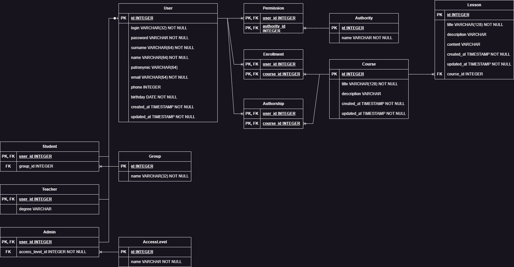

# Brainstormy

Brainstormy is a web-based learning management system designed to help educators create and manage online courses. The
platform is currently in development.

## Architecture

### Database Schema

